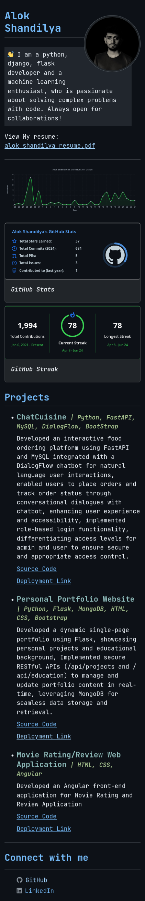

# Personal Website

- [Deployment Link - on Vercel](https://alokshandilya.vercel.app)
- Developed a dynamic single-page portfolio using Flask, showcasing personal projects and educational background.
- Implemented secure RESTful APIs (`/api/projects` and `/api/education`) to manage and update portfolio content in real-time, leveraging MongoDB for seamless data storage and retrieval.
- Ensured robust authentication mechanisms for API endpoints to protect sensitive data.
- Designed an intuitive and interactive user interface to enhance user engagement and provide a comprehensive overview of my professional journey.

## Screenshots

- Desktop View

- Mobile View

  

